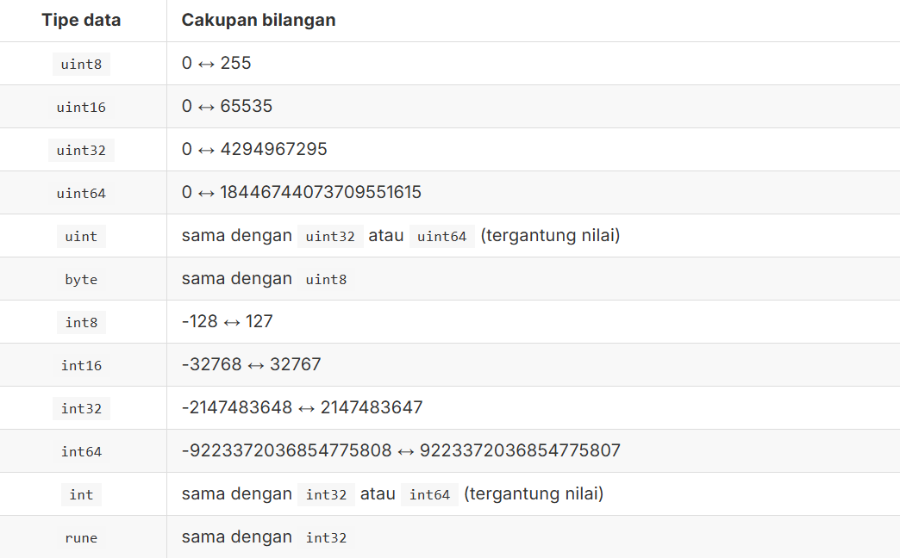

## Data Types

Dianjurkan untuk tidak sembarangan dalam menentukan tipe data variabel, sebisa mungkin tipe yang dipilih harus disesuaikan dengan nilainya, karena efeknya adalah ke alokasi memori variabel. Pemilihan tipe data yang tepat akan membuat pemakaian memori lebih optimal, tidak berlebihan.
