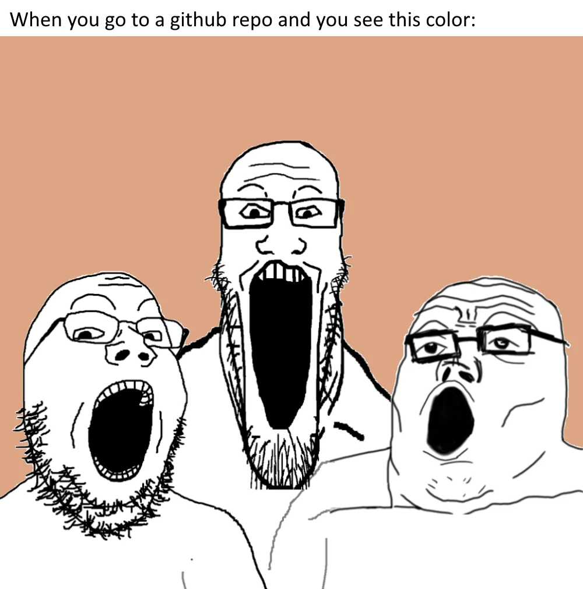

<h1 align="center">1000 Days Progress Tracker</h1>

<!-- Banner GIF -->
<p align="center">
  
</p>

<p align="center">
  I believe that <a href="https://citizenside.com/technology/what-is-computer-technology/">computer technology</a> has brought tremendous changes to our lives. Seeing the rapid development in the world of <a href="https://www.geeksforgeeks.org/software-engineering-introduction-to-software-engineering/">software engineering</a> motivates me to keep learning and innovating. I enjoy <a>exploring new technologies</a> and using them to <a>build solutions that benefit many people.</a>
</p>

<p align="center">
  
  
  
  
  
  
  
  
  
  
  
  
  
  
  
  
  
</p>

---

## 🚀 About This Project

<table>
  <tr>
    <td width="60%" valign="top" style="padding: 8px;">
      <b>1000 Days Progress Tracker</b> is an application to record, monitor, and visualize your skill or habit development over 1000 days. Perfect for developers, students, or anyone who wants to consistently grow. Track your daily progress, get motivated, and visualize your journey!
    </td>
    <td align="center" width="40%">
      
    </td>
  </tr>
  <tr>
    <td width="60%" valign="top">
      <b>1000 Days Progress Tracker</b> is an application to record, monitor, and visualize your skill or habit development over 1000 days. Perfect for developers, students, or anyone who wants to consistently grow. Track your daily progress, get motivated, and visualize your journey!
    </td>
    <td align="center" width="40%">
      
    </td>
  </tr>
  <tr>
    <td width="60%" valign="top">
      <b>1000 Days Progress Tracker</b> is an application to record, monitor, and visualize your skill or habit development over 1000 days. Perfect for developers, students, or anyone who wants to consistently grow. Track your daily progress, get motivated, and visualize your journey!
    </td>
    <td align="center" width="40%">
      
    </td>
  </tr>
</table>

---

## ✨ Features

<!-- Redesigned feature table -->
<table style="width: 100%">
  <tr>
    <th align="center">Feature</th>
    <th align="center">Description</th>
  </tr>
  <tr>
    <td align="center"><b>Daily Progress</b></td>
    <td>Record and monitor your daily achievements easily.</td>
    
  </tr>
  <tr>
    <td align="center"><b>Data Visualization</b></td>
    <td>See your growth with beautiful charts and statistics.</td>
    
  </tr>
  <tr>
    <td align="center"><b>Reminders & Motivation</b></td>
    <td>Get daily notifications and motivational quotes.</td>
    
  </tr>
  <tr>
    <td align="center"><b>Multi-platform</b></td>
    <td>Accessible from various devices and platforms.</td>
    
  </tr>
</table>


---

## 🛠️ Built With

- **[React](https://reactjs.org/)** - A JavaScript library for building user interfaces.
- **[Node.js](https://nodejs.org/)** - JavaScript runtime built on Chrome's V8 JavaScript engine.
- **[Express](https://expressjs.com/)** - Fast, unopinionated, minimalist web framework for Node.js.
- **[MongoDB](https://www.mongodb.com/)** - NoSQL database for modern applications.
- **[Chart.js](https://www.chartjs.org/)** - Simple yet flexible JavaScript charting for designers & developers.

---

## 🧑‍💻 Getting Started

1. **Clone repo**
   ```bash
   git clone https://github.com/username/1000-days-progress-tracker.git
   ```
2. **Install dependencies**
   ```bash
   # Contoh untuk Node.js
   npm install
   ```
3. **Run the app**
   ```bash
   npm start
   ```

---

## 🎯 My Project Goal

> **Vision:**  
> To create an open-source platform that empowers people to build positive habits and achieve their goals through consistent progress tracking and community support.
>
> **Mission:**  
> - Develop a user-friendly, powerful, and free progress tracker for everyone.
> - Integrate with popular productivity tools (Google Calendar, Notion, etc.).
> - Foster a supportive community where users can share and celebrate their progress.
> - Showcase my skills in software engineering, UI/UX, and open-source collaboration through this project.
>
> **Let's grow together and make every day count!**

---

## 🤝 Contributing

Contributions are welcome!  
Feel free to open issues or pull requests for new features or bug fixes.

- Please read the [My Project Goal](#-my-project-goal) section to understand the vision and mission of this project.
- Make sure to follow the code of conduct and contribution guidelines.

---

## 📬 Contact

- Email: [your.email@example.com](mailto:your.email@example.com)
- LinkedIn: [Your Name](https://linkedin.com/in/yourprofile)

---

## 📄 License

This project is licensed under the MIT License.  
See the [LICENSE](LICENSE) file for details.

<!-- Example: How to add a license to your project -->
> **How to add a license:**  
> 1. Create a file named `LICENSE` in your project root.  
> 2. Copy the content of your preferred license (e.g., MIT, Apache 2.0, GPL) into the file.  
> 3. Update the license badge at the top of this README if needed.
